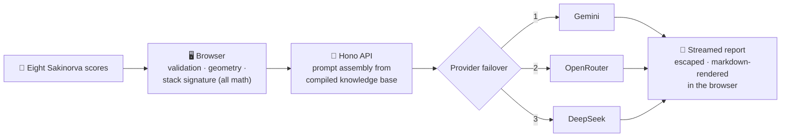

<div align="center">

# 🧠 Mindstack

**Eight cognitive-function scores in. One streamed self-reflection report out.**

A set of hypotheses with the math shown — explicitly **not** a 16-type label.

[](tsconfig.json)
[](vite.config.ts)
[](src/server/app.ts)
[](package.json)
[](test)
[](https://themindstack.vercel.app)

### [✨ Try it live → themindstack.vercel.app](https://themindstack.vercel.app)

[Getting started](#-getting-started) ·
[How it works](#-how-it-works) ·
[Configuration](#-configuration) ·
[Development](#-development) ·
[Deployment](#-deployment) ·
[Design rules](#-where-the-rules-live) ·
[Attribution](#-attribution)

</div>

---

## ✨ What is this?

You take the [Sakinorva cognitive-function test](https://sakinorva.net/functions) and get eight
raw scores (Ni, Ne, Si, Se, Ti, Te, Fi, Fe). Most tools collapse those into a four-letter box.
Mindstack does the opposite:

- 🔢 **All arithmetic runs in your browser.** The stack signature, geometry, and every derived
  number are computed client-side, with the math shown.
- ✍️ **The server only writes prose.** An LLM turns the locally computed structure into a
  plain-language, streamed self-reflection report — hypotheses to test, not verdicts.
- 🔒 **Nothing is stored.** No accounts, no database, no score ever leaves your device except
  as the anonymous numbers needed to write the prose.
- 🌏 **English and Indonesian.** Report language is a first-class selector, with zero
  cross-language contamination.
- 🪫 **Honest degradation.** With no API key configured, the locally computed sections still
  work — only the interpreted prose needs a provider.

## 🚀 Getting started

No install needed to try it — it's live at **[themindstack.vercel.app](https://themindstack.vercel.app)**.

To run it locally:

```bash
git clone https://github.com/rivianpratama/Mindstack.git
cd Mindstack
npm install
npm run build:data   # compiles docs/knowledge/ into src/server/prompt/*.json
                     # (required once, and again after editing knowledge files)
```

Set at least one provider key (see [Configuration](#-configuration)), then run both dev servers:

```bash
npm run dev          # Vite client on :5173, proxies /api to :8787
```

```bash
npm run dev:server   # Hono API on :8787
```

Open <http://localhost:5173>, paste your eight Sakinorva scores, and read.

## 🧭 How it works



The knowledge pipeline feeding the prompt is `docs/sources/ → docs/knowledge/ →
npm run build:data → src/server/prompt/*.json`. The server never sees anything but the numbers
and the language choice.

## ⚙️ Configuration

The API server tries providers in failover order — set any subset
(resolution lives in [src/server/deepseek.ts](src/server/deepseek.ts)):

| Order | Env var              | Default model             | Override with                             |
| :---: | -------------------- | ------------------------- | ----------------------------------------- |
| 1     | `GEMINI_API_KEY`     | `gemini-3.7-flash`        | `GEMINI_BASE_URL` / `GEMINI_MODEL`         |
| 2     | `OPENROUTER_API_KEY` | `minimax/minimax-m3:free` | `OPENROUTER_BASE_URL` / `OPENROUTER_MODEL` |
| 3     | `DEEPSEEK_API_KEY`   | `deepseek-v4-flash`       | `DEEPSEEK_BASE_URL` / `DEEPSEEK_MODEL`     |

<details>
<summary>Optional extras</summary>

| Env var                    | Purpose                                                    |
| -------------------------- | ---------------------------------------------------------- |
| `DEEPSEEK_REASONING_EFFORT`| Reasoning-effort hint passed to DeepSeek                   |
| `OPENROUTER_APP_TITLE`     | `X-Title` attribution header (defaults to `Mindstack`)     |
| `OPENROUTER_APP_URL`       | `HTTP-Referer` attribution header (sent only when set)     |
| `PORT`                     | Node server port (default `8787`)                          |

</details>

## 🛠️ Development

| Command             | What it does                                            |
| ------------------- | ------------------------------------------------------- |
| `npm run dev`       | Vite client on `:5173` (proxies `/api` to `:8787`)      |
| `npm run dev:server`| Hono API on `:8787`                                     |
| `npm test`          | Vitest — plain Node, **no DOM environment**             |
| `npm run typecheck` | `tsc --noEmit`                                          |
| `npm run build:data`| Recompile the knowledge base into prompt JSON           |
| `npm run build`     | Production build: client (`dist/`) + API (`api/index.js`) |

`npm test` and `npm run typecheck` must pass before any commit.

<details>
<summary>📁 Project structure</summary>

```
src/
├── client/          # Browser app — all scoring math lives here
│   ├── styles/      # tokens.css (source of truth), app.css, components.css, motion.css
│   └── ui/          # Components (accordion, dialog, report view, input form…)
├── server/          # Hono API — prompt assembly + provider streaming
│   ├── prompt/      # Compiled knowledge JSON (generated, do not hand-edit)
│   └── routes/      # API endpoints
docs/
├── knowledge/       # Report generator source material → build:data
├── sources/         # Upstream references for the knowledge base
└── design/          # UI provenance & diff-bases for vendored material
test/                # Vitest suites (plain Node)
```

</details>

## ☁️ Deployment

**Vercel** — the production instance runs at
[themindstack.vercel.app](https://themindstack.vercel.app). `npm run build` produces the
expected layout: static client in `dist/`, the Hono
app bundled to `api/index.js`, routed by [vercel.json](vercel.json).

**Self-hosted** — a [Dockerfile](Dockerfile) is included; or run the Node server directly:

```bash
npm start
```

## 📐 Where the rules live

This codebase is opinionated on purpose. Architecture invariants, the motion budget, and the
browser-support floor (~Baseline 2023+) are indexed in [CLAUDE.md](CLAUDE.md) — each line names
the file that owns the rationale. Highlights:

- Zero new runtime dependencies; the dependency list stays server-only.
- Scores are never clamped, rounded, rescaled, or reordered.
- All model output is HTML-escaped before any markdown rule runs.
- Light theme by default; dark is opt-in via `[data-theme='dark']`, never OS preference.
- Every animation states its purpose in a comment and keeps its own reduced-motion guard.

UI provenance for vendored material is in [docs/design/](docs/design/). Never file UI material
in `docs/knowledge/` or `docs/sources/` — that's the report generator's prompt pipeline.

## 🙏 Attribution

Mindstack stands on other people's work, and the knowledge base tags every claim by where it
came from (see the epistemic-tier legend in
[docs/knowledge/00-overview.md](docs/knowledge/00-overview.md)).

**Content & theory**

- [Sakinorva](https://sakinorva.net/functions) — the cognitive-function test whose eight scores
  are Mindstack's only input. Mindstack is not affiliated with Sakinorva.
- [mbti-notes](https://mbti-notes.tumblr.com) — the type theory, fundamentals, development, and
  type-spotting guides that seed the interpretive knowledge base
  ([docs/sources/](docs/sources/)). Attributed in reports as community-derived and unvalidated.
- Naomi Quenk — the "grip" concept, which Mindstack generalizes (and flags as its own
  speculative extension) from fixed inferior functions to measured profile shapes.
- Claims tagged as established science cite the underlying research directly (Fleeson;
  Fleeson & Jayawickreme; Mischel & Shoda; McCrae & Costa; Reynierse; Forer; and others —
  full list in [docs/knowledge/00-overview.md](docs/knowledge/00-overview.md)).

**Design**

- [shadcn/ui](https://ui.shadcn.com) (MIT) — the color palette is shadcn/ui's neutral theme in
  oklch, kept diffable against upstream ([docs/design/shadcn.md](docs/design/shadcn.md)).
- [transitions.dev](https://transitions.dev) by Jakub Antalik — seven motion snippets vendored
  from the `transitions-pro` npm package (MIT), with deviations recorded in
  [docs/design/transitions-dev.md](docs/design/transitions-dev.md).
- Emil Kowalski's essay *You don't need animations* — the motion budget the UI is held to.

---

<div align="center">

**Mindstack** — the math is yours, the prose is a hypothesis.

</div>
