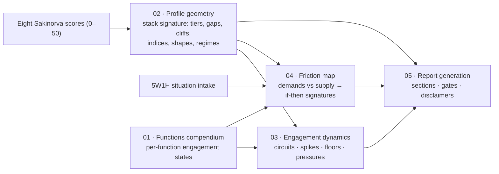

<!-- 00 · Overview — what Mindstack is, how the five components fit together, the epistemic-tier legend, and the canonical glossary. Legend: [S] established science · [D] typology community, unvalidated · [D→H] community concept generalized by Mindstack · [H] Mindstack hypothesis. -->

# Mindstack Knowledge Base — Overview

## What Mindstack is

Mindstack is **not another typology.** It takes the eight Sakinorva cognitive-function scores (Ni, Ne, Si, Se, Ti, Te, Fi, Fe — each roughly 0–50) and produces a personalized psychological profile report. The unit of analysis is the individual **stack signature**: the profile's magnitudes, gaps, ordering, and shape — information invisible to canonical 16-type systems. Only 16 of the 40,320 possible orderings are canonical; real measured profiles almost never match one.

The typology community's one genuinely interesting insight is that "loops" and "grips" are **engagement states** — patterns of which functions get engaged, teamed, avoided, or erupt. Mindstack generalizes that insight from 16 fixed stacks to arbitrary measured profiles, wraps it in measurement discipline (noise bands, marginal windows, honest-null regimes), and forces every interpretation to be falsifiable against the reader's lived experience. The person is the authority; reports offer hypotheses, never verdicts.

These documents are written for two audiences at once: a human reader, and the LLM report generator that will use them as its interpretive engine. Detection conditions are computable from the eight scores; interpretive language is reusable; nothing here claims scientific validation for community-derived or invented material.

## Epistemic tiers

Every interpretive rule in this knowledge base carries exactly one tag. Detection rules are pure arithmetic and carry no tag; only interpretations are tagged.

| Tag | Meaning | Report language |
|---|---|---|
| **[S]** | Established science, cited (Fleeson 2001; Fleeson & Jayawickreme 2015; Mischel & Shoda 1995; McCrae & Costa 1989; Reynierse 2009; Forer 1949; Dickson & Kelly 1985; Randall et al. 2017; Pittenger 2005; Sharma et al. 2024) | "Research on personality suggests…" |
| **[D]** | Derived from typology-community sources (mbti-notes.tumblr.com; Naomi Quenk's grip concept) — attributed, unvalidated | "In typology practice this pattern is described as… (unvalidated)" |
| **[D→H]** | A [D] concept generalized by Mindstack beyond its home theory (e.g., Quenk's grip re-keyed from a fixed inferior to gap-derived shadow floors). Hedged as [H], attributed as [D]. | "Typology writers describe X for fixed types (unvalidated); extending it to your measured shape is our own speculative generalization — test it." |
| **[H]** | Mindstack hypothesis — our own extrapolation, plausible but speculative, flagged as such | "One hypothesis to test against your own experience…" |

No [D], [D→H], or [H] claim may ever borrow [S] language — the "tier audibility" rule in [05 §5.3](05-report-generation.md) enforces this at generation time.

## How the five components fit together

- **[01 · The Functions Compendium](01-functions.md)** — per-function content: what each of the eight processes does at five engagement states (engaged, over-engaged, supporting, unengaged, eruptive), plus situational demand cues and confusables. Raw material composed into every downstream reading.
- **[02 · Profile Geometry](02-profile-geometry.md)** — the measurement layer and the **sole owner of every geometric term and threshold**: noise band, tiers, gaps, cliffs, smears, edge windows, the marginal window, indices, the shape taxonomy, the weak-signal regimes, and the canonical eruption-candidacy rule. Every other component consumes its outputs and defines no geometry of its own; on any discrepancy, 02 wins.
- **[03 · Engagement Dynamics](03-engagement-dynamics.md)** — the generalized loop/grip mechanics, keyed to 02's outputs: closed circuits, pluralistic clusters, lead spikes, shadow-floor isolation, polarized axes, judging/perceiving pressure, weak-signal handling, and the development snapshot.
- **[04 · Situational Conditioning](04-situational-conditioning.md)** — the friction map: a 5W1H intake, a demand taxonomy with an explicit weighting rule, classification of each demand as flow / near-flow / scaffolded stretch / friction / eruption risk against the profile's supply, and if-then signature templates.
- **[05 · Report Generation and Epistemics](05-report-generation.md)** — the rendering contract: report structure and routing, voice rules, tier-to-language mapping, Barnum mitigations as pass/fail gates, uncertainty language, the required disclaimer, and prohibited outputs.

Two profiles are threaded through all components as canonical worked examples, both derived in 02:

- **Profile A** (02 §5): Ni 39.6, Ti 34, Te 31, Fi 30, Ne 25.4, Se 25, Si 21, Fe 8 — introverted marginal Ni spike, smeared support, cliff-isolated Fe floor.
- **Profile B** (02 §7): Se 41, Ne 38, Te 31, Fe 27, Ni 21, Si 19, Ti 16, Fi 8 — extraverted perceiving twin peak, sealed external circuit, gap-isolated (non-cliff) floor.

## Glossary

One canonical definition per term. The component in parentheses owns the term; other files may restate but never redefine it.

### Measurement and geometry (owned by 02)

- **Stack signature** — the full 8-score profile treated as a geometric shape; never a type label.
- **Noise band (B)** — the stipulated resolution limit, default 5 points; score differences ≤ B are ties and must never be interpreted as rank. [H — convention, not a measured standard error]
- **Gap** — an adjacent difference in the sorted profile exceeding B; a tier boundary.
- **Cliff** — an adjacent difference exceeding 2B; itself interpretable via three held hypotheses (suppression / avoidance / non-development). [H]
- **Boundary strength** — gap minus B; descriptive only.
- **Marginal window** — the corpus-wide marginality rule (02 §2.2): a detection exceeding its threshold by ≤ 20% of that threshold is *marginal* — a hedged watch item, never a firm pattern; past the window it is *firm*. At B = 5: gaps 5–6, cliffs 10–12, circuit strength 5–6. Index cutoffs take a "borderline" qualifier within 20% past the cutoff. [H]
- **Engagement tiers** — the gap-derived bands: **Lead cluster** (top segment; if smeared, its upper edge is the operative lead), **Support band**, **Reserve band**, **Shadow floor** (bottom segment). Tier boundaries fall where gaps exceed B — not at fixed stack positions. [H — the core invention]
- **Smeared segment** — a segment whose internal span exceeds B (chained near-ties); real internal differences, no clean internal boundary.
- **Upper edge / lower edge** — members of a smeared segment within B of its maximum / minimum; descriptive windows (they may overlap), never tiers and never a rank.
- **Pairwise rule** — inside a smeared segment, X is genuinely above Y only if the difference exceeds B (hedged if inside the marginal window); the only licensed within-segment comparison.
- **Active set** — the lead cluster, plus the upper edge of the next segment when the lead boundary is marginal; the unit used by composition checks (J/P pressure, pluralistic sub-clusters). [H]
- **Attitude tilt** — (ΣNe,Se,Te,Fe − ΣNi,Si,Ti,Fi) / Σall; the profile's outward/inward processing metabolism — explicitly not sociability. [D]
- **Axis polarization** — per opposing pair (Ni–Se, Ne–Si, Ti–Fe, Te–Fi), the absolute difference, classified balanced (≤ B; sub-classified balanced-high / balanced-low by pair mean vs profile mean), leaning (≤ 2B), polarized (≤ 4B), extreme (> 4B). [D / D→H interpretations]
- **Judging/perceiving pressure** — fires from the composition of the active set (all-judging → judging pressure; all-perceiving → perceiving pressure; mixed → no fire, hedged note at most); the (ΣJ − ΣP) index is context only. [D→H]
- **Differentiation index** — max minus min of the eight scores; low values are weak signal. [H]
- **Elevation** — mean of the eight scores; never interpreted as ability, health, or development. [H]
- **FLAT regime / honest-null rule** — differentiation ≤ 2B: weak signal reported as weak signal, never filled with invented content; takes precedence over every other shape. [H, motivated by Forer 1949 [S]]
- **STAIRCASE regime** — no adjacent gap exceeds B but differentiation > 2B: no tier boundaries; only upper-vs-lower-edge extremes are interpretable. [H]
- **Shape taxonomy (S1–S12 + S3b)** — lead spike (graded marginal / clear / hard), twin peak, pluralistic lead cluster, pluralistic sub-cluster, compressed top, staircase, flat, cliff floor, bimodal split (hollow middle), polarized axis, balanced-high axis, balanced-low axis, single-attitude lead (circuit candidate). (02 §4)
- **Pluralistic sub-cluster (S3b)** — three or more functions mutually within one noise band forming the upper edge below a marginal lead boundary (or of a smeared lead); the licensed detection for "near-lead" clusters — always watch-item grade. [H]
- **Counterweight** — relative to a single-attitude lead, the highest-scoring opposite-attitude function: the profile's built-in exit ramp; reports name it and its activation conditions. [H]
- **Circuit strength** — lead-cluster minimum minus the counterweight score; the circuit fires when > B, graded moderate (≤ 2B) or strong/sealed (> 2B). [H]
- **Eruption candidacy (canonical rule, 02 §6)** — firm candidate: a shadow-floor function whose boundary above is a cliff; gap-but-not-cliff floors get a hedged watch item at most; priority to candidates whose axis partner sits in the lead cluster or upper edge, then depth; at most two candidates rendered per report. [D→H]
- **Supply grade contract (02 §2.1)** — the exported mapping the friction map consumes: Lead → flow; Support → near-flow; Reserve → scaffolded stretch; Shadow → friction; within a smeared segment, upper edge → the segment's base grade, lower edge → one grade lower (floored at scaffolded stretch), overlap or neither window → hedged fork. [H]

### Per-function content (owned by 01)

- **Engagement states** — the five per-function readings computed from the geometry: **engaged** (lead cluster), **over-engaged** (lead cluster with its axis polarized), **supporting** (support/reserve band or corresponding edge window), **unengaged** (shadow floor — cause held open three ways), **eruptive** (cliff-isolated floor under sustained friction and depletion). Distinct from 02's engagement *tiers*, which they are computed from. [D→H]
- **Counterfeit fluency** — a weaker-state function's surface mimicry of engaged expression (commanding like engaged Te, charming like engaged Fe), distinguishable by elevated error rate, defensive flavor, and poor outcomes. [D→H]
- **Demand cue** — a 5W1H feature of a situation that predicts which function the situation requires; feeds the friction map's demand taxonomy. [H]
- **Supporting expression** — per-function description of mid-band supply: reliable-but-effortful second-instrument use, with a characteristic degradation-under-fatigue signature. [H]
- **Eruptive expression** — the per-function catalog of crude, out-of-character behavior under depletion, written in lay behavioral language. [D — Quenk via mbti-notes]

### Dynamics (owned by 03)

- **Closed circuit** — generalized loop: a single-attitude lead with the counterweight more than one noise band below. **Internal circuit** (all-introverted lead: reality-testing starves) / **external circuit** (all-extraverted lead: reflection starves). [D→H]
- **Bridge function** — the strongest function sharing a floored function's attitude, used to route around the floor rather than developing it directly; not the counterweight (different computation — they can coincide). [D→H — Quenk's auxiliary-bridge logic, generalized]
- **Starved-side lever** — under judging or perceiving pressure, the strongest function on the neglected side, with named activation conditions. [H]
- **Arbitration protocol** — for pluralistic clusters: pre-agreed rules assigning which near-tied criterion decides in which life domain. [H]
- **Convergent detection** — two detection rules firing on the same underlying geometry; merged and reported once, never twice.
- **Eruption pointer** — a cross-reference from a shadow-floor function to its eruptive-expression block in 01.
- **Rule of firing** — a dynamic appears in a report only when its detection rule fires on the actual eight scores as computed by 02. [H — anti-Barnum constraint]
- **Rule of composition** — dynamics prose must be composed with the specific functions' 01 blocks; shape-generic text repeated across users is a failure. [H]
- **Development snapshot** — the profile is a photograph of current engagement, not a fixed essence; reports speak in "currently/lately," never "you are and always will be." [D + S]

### Situational conditioning (owned by 04)

- **Friction map** — given a 5W1H context, the estimate of which functions the situation demands vs which the profile supplies, output as if-then signatures. [S framing via CAPS; H mapping]
- **Demand profile** — the weighted set of function-demands extracted from one 5W1H intake; the weighting rule (WHAT primary; multi-field cues outrank; ties break toward the lowest supply grade; cap four) makes the headline auditable. [H]
- **Flow / near-flow / scaffolded stretch / friction / eruption risk** — the five classification outcomes of demand vs supply, per 02 §2.1's contract. [H]
- **Escalation modifier** — a 5W1H feature (sustained duration, high stakes, no-exit, low autonomy, evaluative audience) that moves a friction verdict toward eruption risk; each field contributes 0 or 1. [H]
- **Workaround substitution** — the predicted behavior under friction: a lead/support function stands in for the demanded shadow-floor function, producing characteristic off-target competence. [H]
- **Default context menu** — the fixed list of eight generic contexts used (two or three at a time, said plainly) when the user supplies no 5W1H; selected to maximize supply-grade spread. [H]

### Report generation (owned by 05)

- **Geometry anchor** — every geometric feature interpreted anywhere in the report must first be named, with its numbers, in the stack-signature section. [H]
- **Information budget** — interpretive length capped at roughly 150 words per resolvable feature; flat profiles get short reports. [H]
- **Counter-observation** — the named, reader-observable event that would falsify a specific prediction; every falsifiable prediction ships with one. [H]
- **Cost quota** — at least one-third of interpretive statements state a trade-off or cost, attached to the same geometric feature being credited. [S-motivated]
- **Mirror profile** — the synthetic contrast built by replacing every score s with 50 − s (full inversion: every tier, tilt, and polarization flips; ties stay ties); an interpretive sentence the mirror's holder would accept is anchored to nothing and is deleted or sharpened. [H]
- **Tier audibility** — a claim's epistemic tier must be recoverable from its phrasing alone with tags stripped; enforced by a final audit pass. [H]
- **Fork statement** — the required rendering of a marginal detection: two labeled hypotheses plus the single observation that decides between them. [H]
- **Specificity floor** — interpretive sentences must be behavioral and conditional (situation → response), never adjectival. [H]
- **Salience order** — for multi-shape profiles: cliffs > strong circuits > extreme/polarized axes > lead-shape readings > balanced/quiet axes; top features rendered to budget, the rest named in one sentence. [H]
- **Routing table** — the fixed mapping of 04's outputs to report sections (verdicts → §3; eruption flags → §4; lever activations → §5). [H]

## Sources and attributions

- **mbti-notes.tumblr.com** (function theory, development, and type-spotting guides) — conceptual source for all [D] function descriptions, the loop/avoidance mechanics, the development timeline, and the energy-economics framing. Paraphrased throughout; attributed; unvalidated.
- **Naomi Quenk, *Was That Really Me?* (Davies-Black, 2002)** — the grip/eruption concept and the inferior-function symptom catalogs. [D]
- **[S] literature**: Fleeson (2001) density distributions / Whole Trait Theory; Fleeson & Jayawickreme (2015); Mischel & Shoda (1995) CAPS if-then signatures; McCrae & Costa (1989); Reynierse (2009) — rejection of type dynamics; Forer (1949); Dickson & Kelly (1985); Randall, Isaacson & Ciro (2017); Pittenger (2005), including McCarley & Carskadon (1983); Sharma et al. (2024) on LLM sycophancy.
- **Input instrument**: the Sakinorva cognitive-function test — 96 items, ~12 per function, no published reliability or validity; its author reports results change on retake. It is treated throughout as an unvalidated hobbyist instrument.

Research grounding and verification for every claim above: **[docs/research/mindstack-feasibility.md](../research/mindstack-feasibility.md)** — see §3 (the Sakinorva test), §4 (academic assessment), and §5 (the institutional-use myth). No component may claim scientific validation for [D]/[D→H]/[H] material or imply institutional endorsement.
